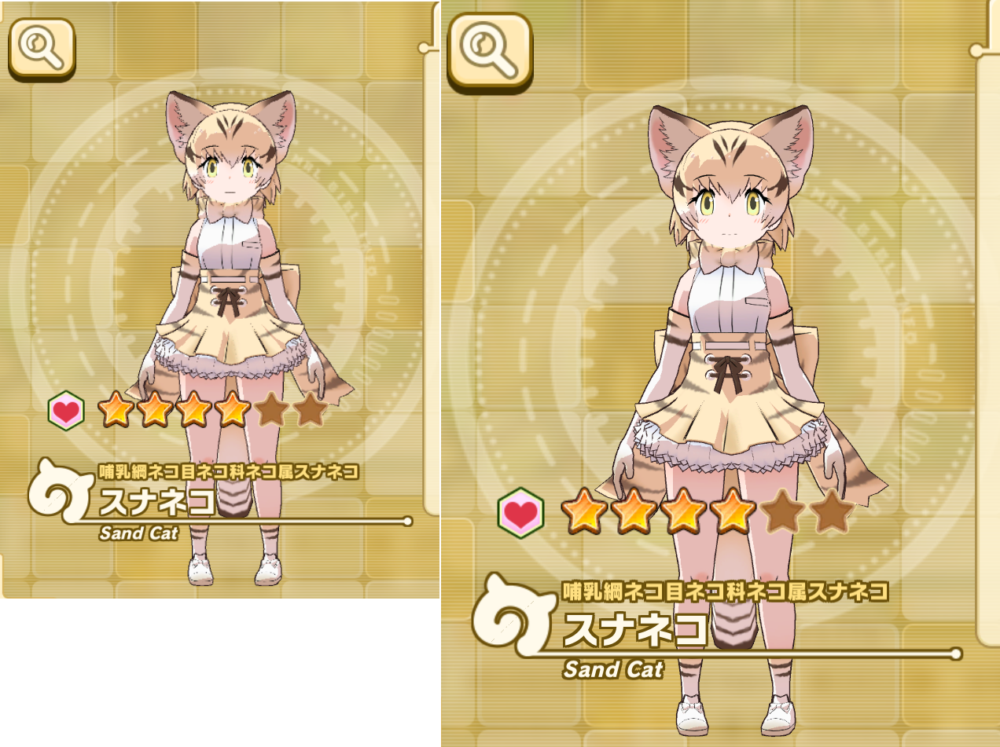
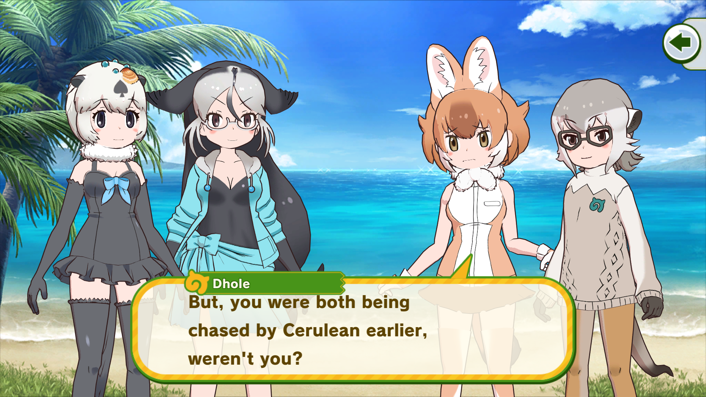
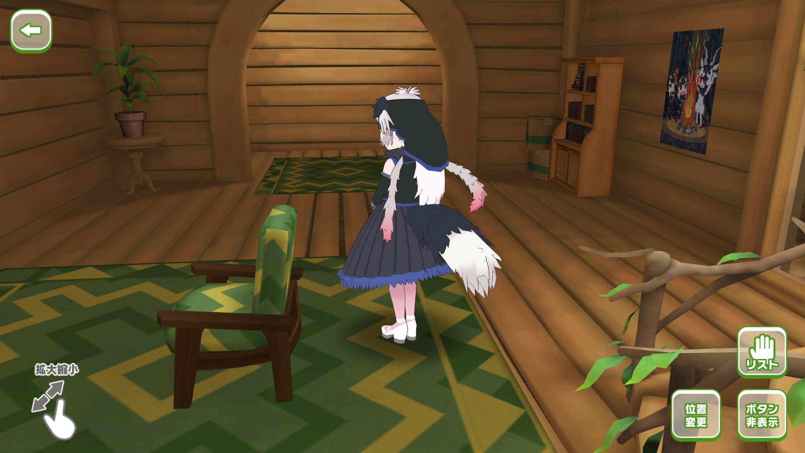

This is a mod for Kemono Friends 3 (DMM version) that improves the graphics quality and adds some keyboard controls.

It functions similarly to the translation mod, in the sense that no game files are modified. As such, it should be as safe/unsafe to use as the translation mod itself, and is compatible with it.

## Installation
Requires BepInEx, which you'll already have if you're using the translation patch.

Extract contents into the BepInEx folder, such that the contents of `plugins` goes into your `plugins` directory and likewise for the `patchers` folder.

- `kf3tweaks.dll` is the plugin
- The MonoMod files and `BepInEx.MonoMod.HookGenPatcher.dll` are required to generate hooks for the game's methods; `LighterPatcher.dll` strips the auto-generated MMHOOK dll to reduce bloat
    - This should allow the mod to keep working after game updates, so long as the patched methods are not significantly altered

## Features
### Graphical improvements
- Unlocked resolution and aspect ratio
    - Not all UIs will be usable with unusual aspect ratios
- Makes the game use up to 8x MSAA instead of 2x/1x, which greatly increases the quality of the anti-aliasing and makes far-away friends look a lot less jagged
- Doubled the size of textures used with camera render-to-texture, which makes friends look a lot less blurry in UIs where they are superposed over a background (ex. friend growth, friend details, Meerkat/Dhole/Peach Panther/Mirai in the UIs)
- Press `Right Alt + Enter` to toggle borderless windowed mode
- Press `Left Alt` to toggle VSync, which will also set the FPS cap of the game to your monitor's

<i>Comparison of friend details between unmodded 1600x900 and 1080p with the plugin.</i>

---

<i>Dialogue at 1080p with 8x MSAA.</i>

## Keyboard controls
Some keyboard controls were added to combat:

- Number keys 1-5 will issue orders; these correspond to friends from left to right
- `Escape` will cancel an order
- `Spacebar` uses a refill
- `F` toggles fast mode
- `A` toggles autoplay

These hotkeys should function the same way as touching the correspoding UI elements.

## Other stuff

- Camera rotation when petting friends is no longer restricted
    - Due to how the camera movement works, in some places it might clip out of bounds. Zooming in/out will not help as it only affects FoV.
    - You cannot do 360 rotations around a friend; once you reach the maximum +/-180 degrees on either axis, you'll have to rotate in the opposite direction to get to the other side

<i>Ostrich-san waiting for her back massage.</i>

## Known Issues
- Friends will appear oversized in the gacha newcomer scene
- `Left Alt` key to toggle VSync appears to not work in some places; use it in the home or combat scenes if you run into this issue (and it will persist)
- Clothing might shake a bit in the picnic scene above 30FPS; this is probably too much of a hassle to fix

## Planned features
- Issuing miracle orders with shift+number key
- Rebinding hotkeys
- BepInEx config file support
- Option to use 4x MSAA instead (though I assure you your GPU is not the bottleneck in this game)
- Fixing text overflow in dialogue when using the translation mod